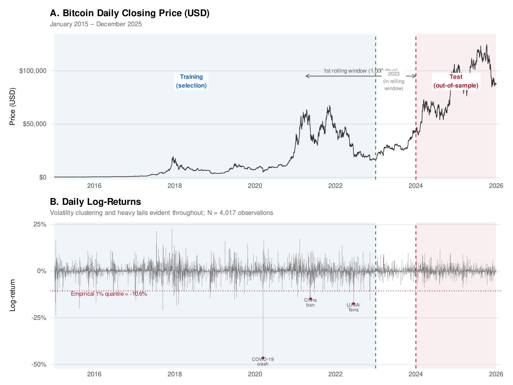

# Nonlinear Scale Dynamics and Distribution Choice in Bitcoin VaR–ES Forecasting

> Replication materials for the paper submitted to **RBFin** (Revista Brasileira de Finanças), 2026.

**Authors:** Lucas M. Oliveira, Luis G. Felix, Anny K. G. Rodrigues



## Overview

This repository provides data and code to replicate all results in the paper. We compare **GAMLSS** models (Power Exponential and Generalized t distributions) against standard benchmarks (Historical Simulation, iGARCH, GARCH-sstd) for 1% VaR and ES forecasting of Bitcoin daily returns, using a 1,000-day rolling window over 2024–2025.

## Repository structure

```
├── data/                   # Raw and merged datasets (2015–2025)
├── scripts/                # R scripts (run in order 00–13)
│   ├── 00_setup.R          # Packages, constants, helper functions
│   ├── 00_merge_and_clean.R
│   ├── 01_create_features.R
│   ├── 02_prepare_data.R
│   ├── 03_dist_selection_main.R
│   ├── 04_dist_selection_robust.R
│   ├── 05_strategy_a_main.R
│   ├── 06_strategy_a_robust.R
│   ├── 07_rolling_main.R
│   ├── 08_rolling_robust.R
│   ├── 09_backtest.R
│   ├── 10_dm_test.R
│   ├── 11_generate_figures.R
│   ├── 12_histogram.R
│   └── 13_btc_series_figure.R
├── outputs/                # Generated tables and figures
│   ├── tables/
│   └── figures/
├── LICENSE
└── README.md
```

## Requirements

R 4.3+ with the following packages:

```r
install.packages(c("data.table", "gamlss", "gamlss.dist", "rugarch", "forecast",
                   "sandwich", "lmtest", "ggplot2", "ggtext", "patchwork",
                   "scales", "xtable", "moments", "zoo"))
```

## Usage

Set your working directory to this repository root, then run scripts in numerical order (00–13):

```r
setwd("/path/to/this/repo")
source("scripts/00_merge_and_clean.R")
source("scripts/01_create_features.R")
# ... and so on through 13
```

## Pipeline

| # | Script | Description |
|---|--------|-------------|
| 00 | `00_setup.R` | Packages, constants, helper functions |
| 00 | `00_merge_and_clean.R` | Merge data sources, LOCF imputation |
| 01 | `01_create_features.R` | Log-returns, growth rates, lags |
| 02 | `02_prepare_data.R` | Train/test split, standardization |
| 03–04 | `03_dist_selection_main.R`, `04_…robust.R` | Distribution selection (26 families) |
| 05–06 | `05_strategy_a_main.R`, `06_…robust.R` | Covariate selection — Strategy A (BIC) |
| 07–08 | `07_rolling_main.R`, `08_…robust.R` | Rolling-window forecasts (PE + GT + benchmarks) |
| 09 | `09_backtest.R` | UC, CC, FZ₀ backtesting |
| 10 | `10_dm_test.R` | Diebold–Mariano tests |
| 11–13 | `11_generate_figures.R`, `12_histogram.R`, `13_btc_series_figure.R` | Figures |

> **Note:** Scripts 07–08 (rolling-window estimation) are computationally intensive and may take several hours depending on hardware.

## Data

Raw CSVs in `data/` sourced from CoinGecko, FRED, Alternative.me, Binance, and Coin Metrics (January 2015 – December 2025).

## Output

Results are saved to `outputs/` (tables in LaTeX/CSV and figures in PDF), created automatically.

## Citation

Paper currently under review at **RBFin**. Citation details (DOI, volume, pages) will be added upon publication.

## License

This project is licensed under the [MIT License](LICENSE).
